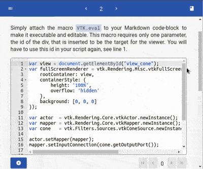

<!--
author:   André Dietrich

email:    andre.dietrich@ovgu.de

version:  0.0.1

language: en

narrator: US English Female

comment:  A set of templetes for VTK programming and visualization in LiaScript.

script:   https://unpkg.com/vtk.js

@VTK.eval
<script>
document.getElementById("@0").innerHTML = "";
eval(`@input`);
</script>

<div id="@0" style="height: 500px"></div>

@end


@VTK.run
<script>
document.getElementById("@0").innerHTML = "";
eval(`@1`);
</script>

<div id="@0" style="height: 500px"></div>

@end


@VTK.load: @VTK._load_(@uid,`@0`)

@VTK._load_
<script>
var vtkColorTransferFunction = vtk.Rendering.Core.vtkColorTransferFunction;
var vtkFullScreenRenderWindow = vtk.Rendering.Misc.vtkFullScreenRenderWindow;
var vtkHttpDataSetReader = vtk.IO.Core.vtkHttpDataSetReader;
var vtkPiecewiseFunction = vtk.Common.DataModel.vtkPiecewiseFunction;
var vtkVolume = vtk.Rendering.Core.vtkVolume;
var vtkVolumeMapper = vtk.Rendering.Core.vtkVolumeMapper;

var view = document.getElementById("vtk_@0");
view.innerHTML = "";
var fullScreenRenderer = vtk.Rendering.Misc.vtkFullScreenRenderWindow.newInstance({
    rootContainer: view,
    containerStyle: {
        height: '100%',
        overflow: 'hidden'
    },
    background: [0, 0, 0]
});

const renderer = fullScreenRenderer.getRenderer();
const renderWindow = fullScreenRenderer.getRenderWindow();

const reader = vtkHttpDataSetReader.newInstance();

const actor = vtkVolume.newInstance();
const mapper = vtkVolumeMapper.newInstance();
mapper.setSampleDistance(0.7);
actor.setMapper(mapper);

const ctfun = vtkColorTransferFunction.newInstance();
ctfun.addRGBPoint(200.0, 0.4, 0.2, 0.0);
ctfun.addRGBPoint(2000.0, 1.0, 1.0, 1.0);
const ofun = vtkPiecewiseFunction.newInstance();
ofun.addPoint(200.0, 0.0);
ofun.addPoint(1200.0, 0.5);
ofun.addPoint(3000.0, 0.8);
actor.getProperty().setRGBTransferFunction(0, ctfun);
actor.getProperty().setScalarOpacity(0, ofun);
actor.getProperty().setScalarOpacityUnitDistance(0, 4.5);
actor.getProperty().setInterpolationTypeToLinear();
actor.getProperty().setUseGradientOpacity(0, true);
actor.getProperty().setGradientOpacityMinimumValue(0, 15);
actor.getProperty().setGradientOpacityMinimumOpacity(0, 0.0);
actor.getProperty().setGradientOpacityMaximumValue(0, 100);
actor.getProperty().setGradientOpacityMaximumOpacity(0, 1.0);
actor.getProperty().setShade(true);
actor.getProperty().setAmbient(0.2);
actor.getProperty().setDiffuse(0.7);
actor.getProperty().setSpecular(0.3);
actor.getProperty().setSpecularPower(8.0);

mapper.setInputConnection(reader.getOutputPort());

reader
  .setUrl(
    '@1',
    { fullPath: true, compression: 'zip', loadData: true }
  )
  .then(() => {
    renderer.addVolume(actor);
    renderer.resetCamera();
    renderer.getActiveCamera().zoom(1.5);
    renderer.getActiveCamera().elevation(70);
    renderer.updateLightsGeometryToFollowCamera();
    renderWindow.render();
  });

</script>

<div id="vtk_@0" style="height: 500px"></div>

@end

-->

# VTK_template

                                   --{{0}}--
This document defines some basic macros for applying
[VTKjs](https://kitware.github.io/vtk-js/examples/) in
[LiaScript](https://LiaScript.github.io), to make VTK programs in Markdown
executeable and editable.

__Try it on LiaScript:__

<!-- hidden = "true" -->


https://liascript.github.io/course/?https://raw.githubusercontent.com/liaScript/vtk_template/master/README.md

__See the project on Github:__

https://github.com/liaScript/vtk_template

                                   --{{1}}--
There are three ways to use this template. The easiest way is to use the
`import` statement and the url of the raw text-file of the master branch or any
other branch or version. But you can also copy the required functionionality
directly into the header of your Markdown document, see therefor the
[last slide](#5). And of course, you could also clone this project and change
it, as you wish.

                                     {{1}}
1. Load the macros via

   `import: https://raw.githubusercontent.com/liaScript/vtk_template/master/README.md`

2. Copy the definitions into your Project

3. Clone this repository on GitHub


## `VTK.eval`

                                   --{{0}}--
Simply attach the macro `VTK.eval` to your Markdown code-block to make it
executable and editable. This macro requires only one parameter, the id of the
div, that is inserted to be the target for the viewer. You will have to use this
id in your script again, see line 1.

```js
var view = document.getElementById("view_cone");
var fullScreenRenderer = vtk.Rendering.Misc.vtkFullScreenRenderWindow.newInstance({
    rootContainer: view,
    containerStyle: {
        height: '100%',
        overflow: 'hidden'
    },
    background: [0, 0, 0]
});

var actor  = vtk.Rendering.Core.vtkActor.newInstance();
var mapper = vtk.Rendering.Core.vtkMapper.newInstance();
var cone   = vtk.Filters.Sources.vtkConeSource.newInstance();

actor.setMapper(mapper);
mapper.setInputConnection(cone.getOutputPort());

var renderer = fullScreenRenderer.getRenderer();
renderer.addActor(actor);
renderer.resetCamera();

var renderWindow = fullScreenRenderer.getRenderWindow();
renderWindow.render();
```
@VTK.eval(view_cone)

## `VTK.run`

                                   --{{0}}--
If you only want to execute your VTK script, you can use the macro `VTK.run`
with the block notation. Simply add it to the head of the of the code-block
together with the id of target div.

```js @VTK.run(view_cone_2)
var view = document.getElementById("view_cone_2");
var fullScreenRenderer = vtk.Rendering.Misc.vtkFullScreenRenderWindow.newInstance({
    rootContainer: view,
    containerStyle: {
        height: '100%',
        overflow: 'hidden'
    },
    background: [0, 0, 0]
});

var actor  = vtk.Rendering.Core.vtkActor.newInstance();
var mapper = vtk.Rendering.Core.vtkMapper.newInstance();
var cone   = vtk.Filters.Sources.vtkConeSource.newInstance();

actor.setMapper(mapper);
mapper.setInputConnection(cone.getOutputPort());

var renderer = fullScreenRenderer.getRenderer();
renderer.addActor(actor);
renderer.resetCamera();

var renderWindow = fullScreenRenderer.getRenderWindow();
renderWindow.render();
```

## `VTK.load`

> __Note:__ This might take a while, to load and render the vti data set within the browser.

@VTK.load(https://data.kitware.com/api/v1/file/58e665158d777f16d095fc2e/download)

## Implementation

                                   --{{0}}--
The code shows how the macros were implemented. For `@VTK.eval` and `.run` there
are only basic substitution rules. In case of `@VTK.load` a hidden macro is
defined, which is called in the background. It includes only one JavaScript tag
that defines how the data from the URL resource gets loaded.

``` html
script:   https://unpkg.com/vtk.js

@VTK.eval
<script>
document.getElementById("@0").innerHTML = "";
eval(`@input`);
</script>

<div id="@0" style="height: 500px"></div>

@end


@VTK.run
<script>
document.getElementById("@0").innerHTML = "";
eval(`@1`);
</script>

<div id="@0" style="height: 500px"></div>

@end


@VTK.load: @VTK._load_(@uid,`@0`)

@VTK._load_
<script>
var vtkColorTransferFunction = vtk.Rendering.Core.vtkColorTransferFunction;
var vtkFullScreenRenderWindow = vtk.Rendering.Misc.vtkFullScreenRenderWindow;
var vtkHttpDataSetReader = vtk.IO.Core.vtkHttpDataSetReader;
var vtkPiecewiseFunction = vtk.Common.DataModel.vtkPiecewiseFunction;
var vtkVolume = vtk.Rendering.Core.vtkVolume;
var vtkVolumeMapper = vtk.Rendering.Core.vtkVolumeMapper;

var view = document.getElementById("vtk_@0");
view.innerHTML = "";
var fullScreenRenderer = vtk.Rendering.Misc.vtkFullScreenRenderWindow.newInstance({
    rootContainer: view,
    containerStyle: {
        height: '100%',
        overflow: 'hidden'
    },
    background: [0, 0, 0]
});

const renderer = fullScreenRenderer.getRenderer();
const renderWindow = fullScreenRenderer.getRenderWindow();

const reader = vtkHttpDataSetReader.newInstance();

const actor = vtkVolume.newInstance();
const mapper = vtkVolumeMapper.newInstance();
mapper.setSampleDistance(0.7);
actor.setMapper(mapper);

const ctfun = vtkColorTransferFunction.newInstance();
ctfun.addRGBPoint(200.0, 0.4, 0.2, 0.0);
ctfun.addRGBPoint(2000.0, 1.0, 1.0, 1.0);
const ofun = vtkPiecewiseFunction.newInstance();
ofun.addPoint(200.0, 0.0);
ofun.addPoint(1200.0, 0.5);
ofun.addPoint(3000.0, 0.8);
actor.getProperty().setRGBTransferFunction(0, ctfun);
actor.getProperty().setScalarOpacity(0, ofun);
actor.getProperty().setScalarOpacityUnitDistance(0, 4.5);
actor.getProperty().setInterpolationTypeToLinear();
actor.getProperty().setUseGradientOpacity(0, true);
actor.getProperty().setGradientOpacityMinimumValue(0, 15);
actor.getProperty().setGradientOpacityMinimumOpacity(0, 0.0);
actor.getProperty().setGradientOpacityMaximumValue(0, 100);
actor.getProperty().setGradientOpacityMaximumOpacity(0, 1.0);
actor.getProperty().setShade(true);
actor.getProperty().setAmbient(0.2);
actor.getProperty().setDiffuse(0.7);
actor.getProperty().setSpecular(0.3);
actor.getProperty().setSpecularPower(8.0);

mapper.setInputConnection(reader.getOutputPort());

reader
  .setUrl(
    '@1',
    { fullPath: true, compression: 'zip', loadData: true }
  )
  .then(() => {
    renderer.addVolume(actor);
    renderer.resetCamera();
    renderer.getActiveCamera().zoom(1.5);
    renderer.getActiveCamera().elevation(70);
    renderer.updateLightsGeometryToFollowCamera();
    renderWindow.render();
  });
</script>

<div id="vtk_@0" style="height: 500px"></div>

@end
```

--{{1}}--
If you want to minimize loading effort in your LiaScript project, you can also
copy this code and paste it into your main comment header, see the code in the
raw file of this document.

{{1}} https://raw.githubusercontent.com/liaScript/vtk_template/master/README.md
