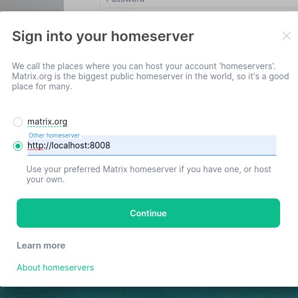
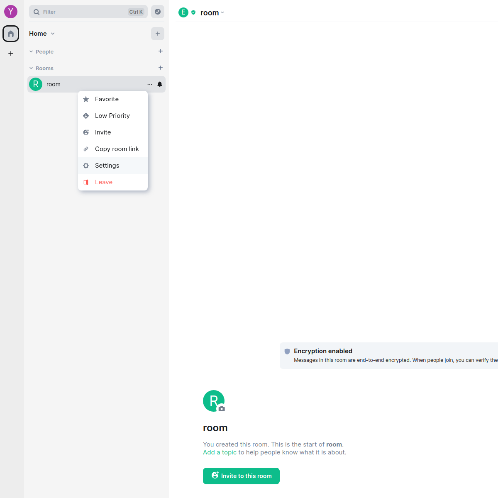
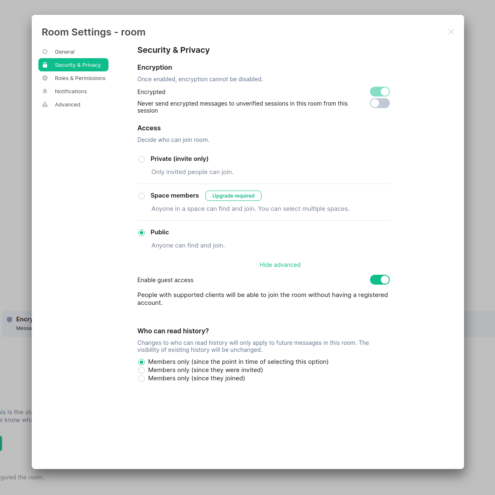
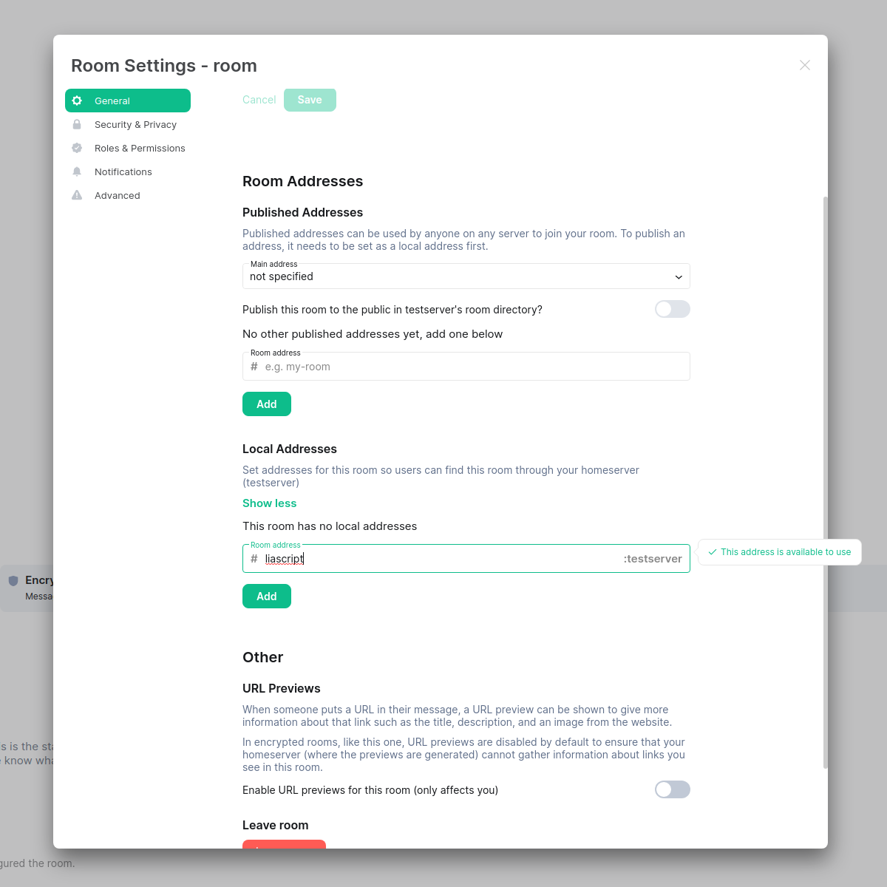

# Matrix Synapse
If you wan't to use the synchronization via Matrix, you have to set up a homeserver yourself.
You could download the synapse implementation of matrix for example via most linux repositories.
But in my opinion the setup is more convient if you download the python script directly via pip.

For more information, look here: <https://pypi.org/project/matrix-synapse/>

### Short install instruction:
- setup a virtual environment and install synapse (you need python-venv installed):
```shell
mkdir -p ~/synapse && cd ~/synapse
python3 -m venv ./env
source ~/synapse/env/bin/activate
pip3 install --upgrade pip3
pip3 install --upgrade setuptools
pip3 install matrix-synapse
```
- then you need to create a new config file for your server:
```shell
python -m synapse.app.homeserver \
    --server-name name \
    --config-path homeserver.yaml \
    --generate-config \
    --report-stats=[yes|no]
```
- in the config, you need to enable guest access
```yaml
turn_allow_guests: true  # line 1163
allow_guest_access: true # line 1276 
```
- start the server:
```shell
cd ~/synapse
source env/bin/activate
synctl start
```
- the server now should run at <http://localhost:8008>, you can check this by visiting this website with a browser. There should be a website reminding you, that you need a client to use matrix
- you should now be able to create a admin user:
```shell
register_new_matrix_user -c homeserver.yaml http://localhost:8008
```
- then you need to create a new room with the room alias `#liascript:your_server_name`. This room needs to be public and needs guest access enabled. To do this, you can use a matrix webclient (e.g. <https://element.io/>). There you have to login with the admin user and create a room with the correct settings. The pictures below may help you in figuring out how to do this in element.

Change the server on login to your server



Create a new room (the name can be set to anything) and go to the room settings by right clikcing the room



In Security & Privacy Settings: Make the room public and under `Show advanced` enable guest access



Under General Settings: Add the local room alias: `liascript`



- Syncing should now be possible via your self hosted matrix server